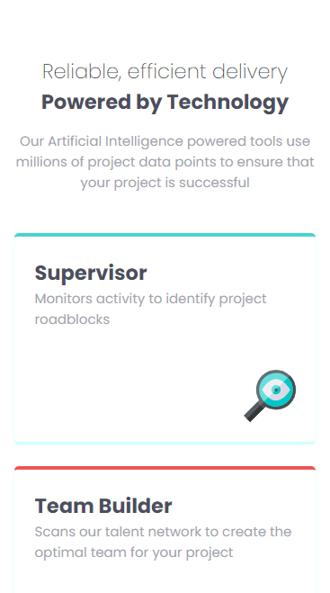

# Frontend Mentor - Four card feature section solution

This is a solution to the [Four card feature section challenge on Frontend Mentor](https://www.frontendmentor.io/challenges/four-card-feature-section-weK1eFYK).

## Table of contents

- [Overview](#overview)
  - [The challenge](#the-challenge)
  - [Screenshot](#screenshot)
  - [Links](#links)
- [My process](#my-process)
  - [Built with](#built-with)
  - [What I learned](#what-i-learned)
  - [Useful resources](#useful-resources)

**Note: Delete this note and update the table of contents based on what sections you keep.**

## Overview

### The challenge

Users should be able to:

- View the optimal layout for the site depending on their device's screen size

### Screenshot

### Links

- Solution URL: [Solution](https://github.com/jjuniorbrasil/vessel/tree/main/Frontend%20Mentor/four-card-feature-section-master)
- Live Site URL: [Live site](https://jjuniorbrasil.github.io/vessel/Frontend%20Mentor/four-card-feature-section-master/)

## My process

### Built with

- Semantic HTML5 markup
- CSS custom properties
- Flexbox
- CSS Grid
- Mobile-first workflow

### What I learned

Mainly, remembered how to use CSS grid. There's a lot of cool stuff you can use if you are able to manage the grid structure which you won't see here, but I pretend to implement later. I think I'm more confident about building a page from pre-made designs.

### Useful resources

- [This CSS Grid tutorial will always save your day](https://css-tricks.com/snippets/css/complete-guide-grid/) - This helped me for XYZ reason. I really liked this pattern and will use it going forward.