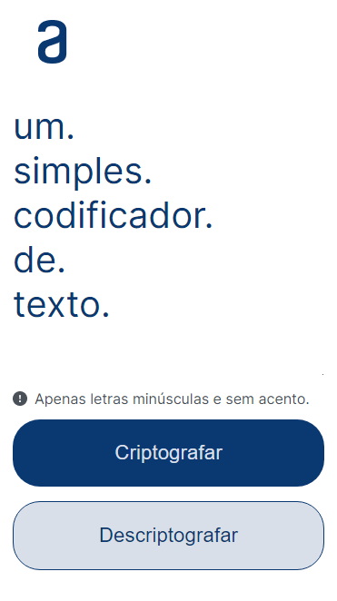
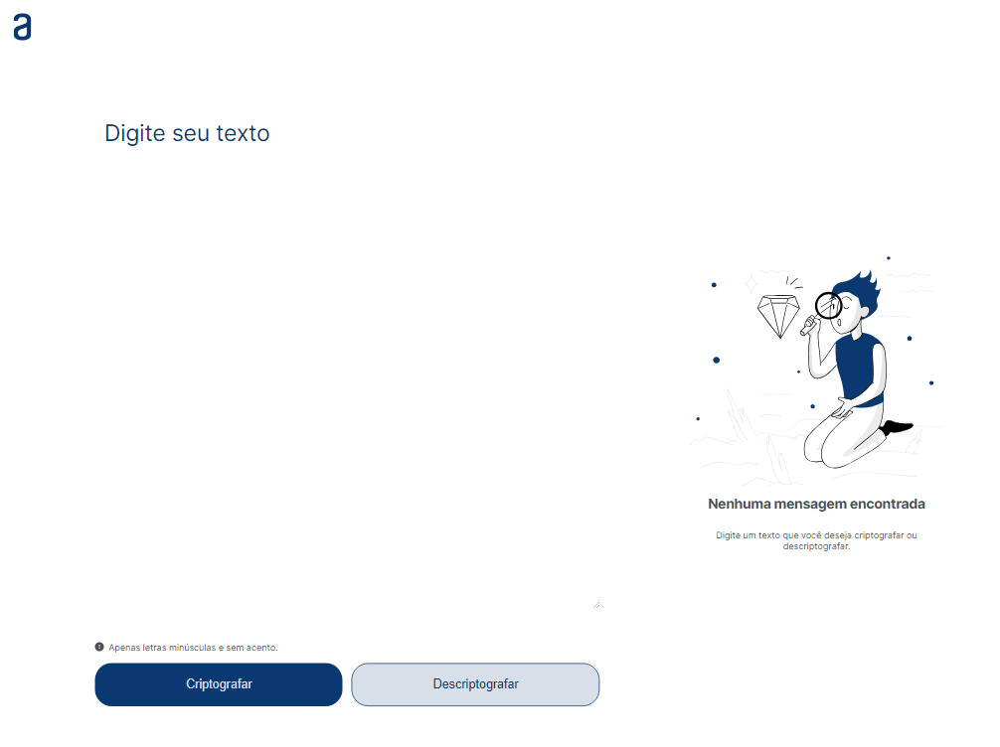

# Alura - Challenge 1
## Decodificador de texto

## Índice

- [Visão geral](#visão-geral)
  - [O desafio](#o-desafio)
  - [Screenshot](#screenshot)
  - [Links](#links)

## Visão geral

### O desafio

O usuário deve ser capaz de:

- inserir um texto que será criptografado
- obter uma mensagem a partir de um texto criptografado
- copiar a mensagem exibida ao clicar em um botão

### Screenshot

  
  

### Links

- Código: [click here.](https://github.com/jjuniorbrasil/vessel/blob/main/ONE/Challenge-1/index.html)
- Página: [click here.](https://jjuniorbrasil.github.io/vessel/ONE/Challenge-1/index.html)